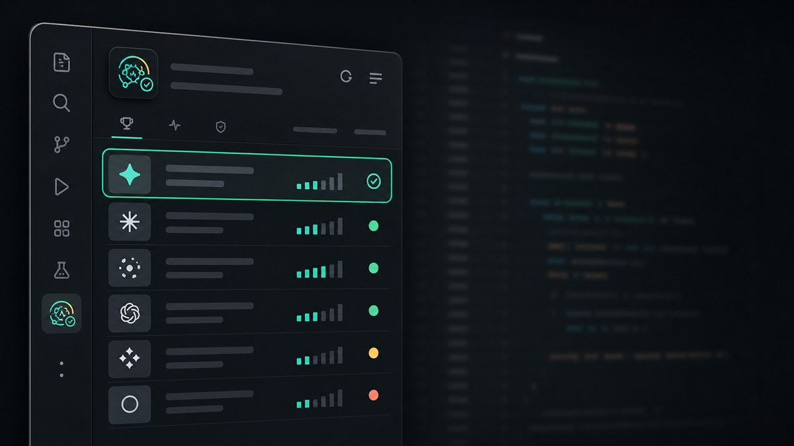

# GitHubCopilotModelAdvisor

> A preview VS Code extension that helps you choose the best GitHub Copilot Chat model for the moment you are working in.

[](CHANGELOG.md)
[](https://code.visualstudio.com/)
[](LICENSE)
[](#preview-status)

It compares the Copilot models available to your account, measures first-token latency with a tiny prompt, checks public provider health, and recommends the fastest healthy option.



## Contents

- [Why Use It](#why-use-it)
- [Quickstart](#quickstart)
- [How It Works](#how-it-works)
- [Scoring](#scoring)
- [Configuration](#configuration)
- [Commands](#commands)
- [Limits](#limits)
- [Support](#support)
- [Preview Status](#preview-status)
- [Author](#author)
- [Development](#development)
- [Repository](#repository)
- [License](#license)

## Why Use It

Copilot model choice changes the feel of a coding session. A model can be technically available but unusually slow, or a provider can be reporting degraded service while another model is healthy.

GitHubCopilotModelAdvisor keeps that signal inside VS Code:

- Open a dedicated Activity Bar sidebar.
- Run a one-click model check.
- See the recommended model first.
- Compare latency, provider health, and active incidents.
- Keep a compact status bar summary visible while you work.
- Get detailed diagnostics in the `GitHubCopilotModelAdvisor` output channel.

## Quickstart

1. Install GitHub Copilot Chat and sign in to GitHub in VS Code.
2. Install or launch GitHubCopilotModelAdvisor.
3. Open the `Model Advisor` icon in the Activity Bar.
4. Click `Run check`, or run `GitHubCopilotModelAdvisor: Check Models Now` from the Command Palette.
5. Use the recommended model shown at the top of the sidebar.

The default shortcut is:

| Platform | Shortcut |
| --- | --- |
| Windows / Linux | `Ctrl+Shift+M` |
| macOS | `Cmd+Shift+M` |

Each check uses a tiny prompt, `hi` by default. Expect roughly 5 Copilot tokens per model.

## How It Works

The extension uses the VS Code language model API to discover Copilot models available to your account:

```ts
vscode.lm.selectChatModels({ vendor: "copilot" })
```

For each model, it measures time to first token by sending the configured test prompt and cancelling the stream as soon as the first response chunk arrives. This gives a practical latency signal without waiting for a full response.

In parallel, it checks public provider health pages for:

| Provider | Source |
| --- | --- |
| OpenAI | `https://status.openai.com/api/v2/summary.json` |
| Anthropic | `https://status.anthropic.com/api/v2/summary.json` |
| GitHub | `https://www.githubstatus.com/api/v2/summary.json` |

The sidebar then combines model latency, provider status, and active incidents into a ranked recommendation.

## Scoring

Every model starts with a score of `100`.

Latency penalties:

| Signal | Penalty |
| --- | --- |
| Under 800 ms | `0` |
| 800 to 1500 ms | `-10` |
| 1500 to 3000 ms | `-30` |
| Over 3000 ms | `-50` |
| Timeout | `-90` |
| Error | `-80` |

Provider health penalties:

| Signal | Penalty |
| --- | --- |
| Operational | `0` |
| Degraded performance | `-20` |
| Partial outage | `-40` |
| Major outage | `-80` |
| Unknown | `-5` |

Active incidents add another `-30`. If scores tie, the lower-latency model wins.

## Configuration

Common settings:

| Setting | Default | Purpose |
| --- | --- | --- |
| `githubCopilotModelAdvisor.autoCheckOnStartup` | `false` | Run a check when VS Code starts. |
| `githubCopilotModelAdvisor.showInStatusBar` | `true` | Show the clickable status bar item. |
| `githubCopilotModelAdvisor.testPrompt` | `hi` | Tiny prompt used to measure first-token latency. |

Open settings from the sidebar title action or run `GitHubCopilotModelAdvisor: Open Settings`.

## Commands

| Command | Purpose |
| --- | --- |
| `GitHubCopilotModelAdvisor: Open Advisor` | Opens the Activity Bar webview. |
| `GitHubCopilotModelAdvisor: Check Models Now` | Runs model detection, latency checks, provider health checks, and scoring. |
| `GitHubCopilotModelAdvisor: Open Settings` | Opens extension settings. |

## Limits

GitHubCopilotModelAdvisor is a practical advisor, not a provider oracle.

It does not:

- Change the selected Copilot model automatically. VS Code does not expose that control.
- Predict when a provider will recover.
- Detect silent provider saturation if latency still looks healthy and no incident is declared.
- Parse Google/Gemini status in v1, because that status API has a different shape.
- Avoid all token usage. Each check intentionally sends a tiny Copilot prompt per model.

## Support

- Report bugs through GitHub Issues.
- Include your VS Code version, operating system, extension version, and whether GitHub Copilot Chat is installed and signed in.
- Do not open public issues with secrets, private prompts, provider tokens, or sensitive workspace output.

See [SUPPORT.md](SUPPORT.md) and [SECURITY.md](SECURITY.md).

## Preview Status

GitHubCopilotModelAdvisor is an early preview.

Current priorities:

- Validate model discovery across Copilot account types.
- Polish webview states for no models, missing Copilot Chat, and partial provider status failures.
- Add screenshots and Marketplace copy after the first live extension-host pass.
- Keep the recommendation simple enough to trust at a glance.

## Development

Install dependencies:

```bash
npm install
```

Compile and validate:

```bash
npm run check
npm run compile
npm run package
```

Press `F5` in VS Code to launch an Extension Development Host.

## Author

Carlos Perez  
GitHub: [@cperezsx](https://github.com/cperezsx)  
LinkedIn: [cperezsx](https://www.linkedin.com/in/cperezsx/)

## Repository

Main branch: `main`

Working branch: `develop`

## License

MIT. See [LICENSE](LICENSE).
